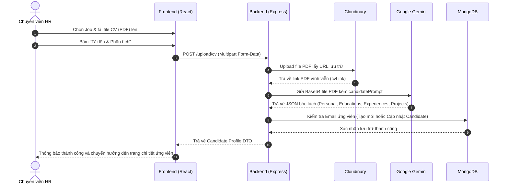
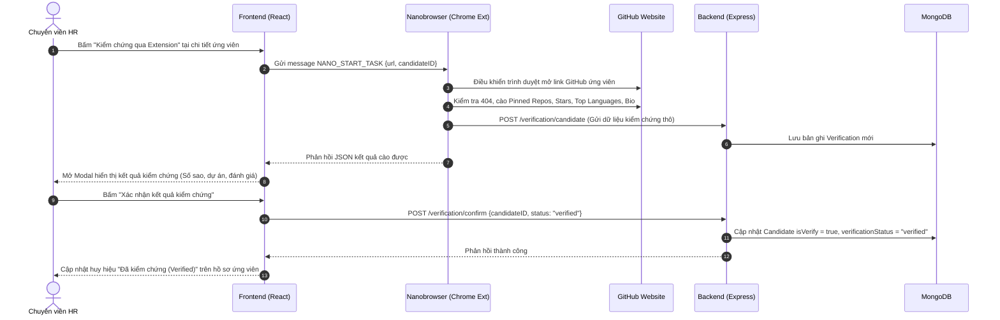

# Intelligent HR Assistant (Nanobrowser HR Agent)
> **Đồ án môn: Học Tăng Cường (Reinforcement Learning - HK7)**  
> **Nhóm thực hiện:** 5 thành viên

**Nanobrowser HR Agent** là một nền tảng quản lý tuyển dụng toàn diện dành cho chuyên viên Nhân sự (HR) và Quản trị viên (Admin). Hệ thống tích hợp sức mạnh của **Generative AI (Google Gemini)** và **Học Tăng Cường (Reinforcement Learning - RL)**, kết hợp cùng Chrome Extension đa tác tử (**Nanobrowser**) để tự động hóa toàn bộ quy trình: từ phân tích CV, sàng lọc hồ sơ ứng viên theo hạn ngạch phỏng vấn, đến việc tự động duyệt web kiểm chứng (Verification) hồ sơ GitHub của ứng viên.

---

## Mục tiêu dự án & Đối tượng sử dụng

Hệ thống được thiết kế chuyên biệt phục vụ 2 nhóm người dùng nội bộ doanh nghiệp:
1. **Chuyên viên Tuyển dụng (HR):**
   - Quản lý tin tuyển dụng (Job Management).
   - Tải lên và trích xuất hồ sơ ứng viên từ CV (PDF).
   - **Sàng lọc ứng viên tự động bằng thuật toán RL (DQN)** để chọn ra danh sách phỏng vấn tối ưu nhất trong hạn ngạch cho phép.
   - **Kiểm chứng ứng viên tự động qua Nanobrowser (PPO/Q-Learning)**: Tự động điều khiển trình duyệt cào và xác thực thông tin dự án, số sao GitHub của ứng viên.
   - Lên lịch phỏng vấn và gửi email tiếp cận tự động.
2. **Quản trị viên (Admin):**
   - Quản lý tài khoản HR (cấp quyền, kích hoạt/khóa tài khoản).
   - Xem báo cáo, thống kê hiệu suất tuyển dụng và lịch phỏng vấn tổng quan.

> **Lưu ý nghiệp vụ:** Hệ thống không có cổng đăng nhập hay khung chat trực tiếp với ứng viên. Ứng viên là các thực thể dữ liệu được xử lý, sàng lọc và kiểm chứng tự động phục vụ cho quyết định tuyển dụng của HR.

---

## ỨNG DỤNG HỌC TĂNG CƯỜNG (REINFORCEMENT LEARNING)

Hệ thống ứng dụng **2 thuật toán Học Tăng Cường riêng biệt** giải quyết 2 bài toán cốt lõi trong quy trình tuyển dụng:

```
[HR Tải CV & Tạo Job] 
         │
         ▼
┌─────────────────────────────────┐
│       THUẬT TOÁN 1: DQN         │ ===> Đọc đặc trưng CV & Job, cân đối hạn ngạch
│ (Candidate Screening & Matching)│ ===> Ra quyết định: ACCEPT / REJECT / HOLD
└────────────────┬────────────────┘
                 │
                 ▼ (Top ứng viên tiềm năng được chọn)
┌─────────────────────────────────┐
│     THUẬT TOÁN 2: PPO / Q-LEARN │ ===> Điều khiển Nanobrowser Extension
│  (GitHub Verification Policy)   │ ===> Tự động cào Pinned Repos, Stars, xử lý 404
└────────────────┬────────────────┘
                 │
                 ▼
[HR Xem Báo Cáo Kiểm Chứng & Gửi Lịch Phỏng Vấn]
```

---

### 1. Thuật toán 1: Deep Q-Network (DQN) — Sàng lọc & Ghép cặp hồ sơ ứng viên
* **Vị trí tích hợp:** Backend Express / Microservice RL.
* **Bài toán giải quyết:** *Sàng lọc ứng viên tuần tự có ràng buộc hạn ngạch (Sequential Candidate Screening with Budget Constraint)*.
  * Khi có $N$ hồ sơ nộp vào (ví dụ 50 CV), nhưng HR chỉ có thời gian phỏng vấn tối đa $K$ ứng viên (ví dụ 5 suất). DQN đóng vai trò là bộ lọc thông minh, học chiến lược khi nào nên duyệt ngay, khi nào nên từ chối hoặc chờ hồ sơ tốt hơn.
* **Mô hình hóa MDP (Markov Decision Process):**
  * **Trạng thái (State $s_t$):** Vector đặc trưng (24 chiều) gồm: Điểm tương đồng kỹ năng (Gemini Matching Score), số năm kinh nghiệm, học vấn, số sao GitHub, cờ xác thực (Verified/Risky), tỷ lệ suất phỏng vấn còn lại ($k_{remain}/K$) và tỷ lệ hồ sơ chưa duyệt ($n_{remain}/N$).
  * **Hành động (Action $a_t$):** 3 hành động rời rạc:
    * `0: REJECT` — Loại hồ sơ.
    * `1: ACCEPT` — Duyệt vào phỏng vấn (tiêu tốn 1 suất).
    * `2: HOLD` — Đưa vào danh sách chờ.
  * **Hàm phần thưởng (Reward $r_t$):**
    * Duyệt đúng ứng viên phù hợp cao (được HR chốt phỏng vấn): $+2.0$.
    * Duyệt nhầm ứng viên yếu: $-1.5$.
    * Bỏ lỡ (Reject) một ứng viên có năng lực xuất sắc: $-2.0$.
    * Chọn đủ $K$ suất phỏng vấn với chất lượng trung bình cao: Thưởng kết thúc episode $+5.0$.

---

### 2. Thuật toán 2: PPO / Q-Learning — Tối ưu hóa quy trình Kiểm chứng GitHub (Verification Policy)
* **Vị trí tích hợp:** Chrome Extension `nanobrowser` (Background Service Worker).
* **Bài toán giải quyết:** *Điều hướng tối ưu quy trình kiểm chứng hồ sơ ứng viên qua GitHub*.
  * Khi HR bấm **"Kiểm chứng qua Extension"** từ giao diện chi tiết ứng viên, Nanobrowser mở link GitHub của ứng viên. Thay vì gọi LLM tốn kém cho từng cú click, Agent RL sẽ quyết định chuỗi hành động nhanh nhất để cào: Pinned Repositories, số sao GitHub, trường học, bio và nhận biết link lỗi (404).
* **Mô hình hóa MDP:**
  * **Trạng thái (State $s_t$):** Vector trạng thái trang web:
    * Loại trang hiện tại: Trang cá nhân, tab Repositories, trang lỗi 404.
    * Trạng thái dữ liệu đã cào được: `[has_name, has_pinned_repos, has_stars, has_school, step_count]`.
  * **Hành động (Action $a_t$):**
    * `0: EXTRACT_PINNED` — Cào khối Pinned Repositories (tên dự án, ngôn ngữ, số sao).
    * `1: SWITCH_TAB_REPOS` — Nếu không có Pinned, chuyển sang tab Repositories để lấy dự án nổi bật.
    * `2: READ_BIO_README` — Cuộn chuột đọc bio/README cá nhân để trích xuất trường học và thông tin liên hệ.
    * `3: ABORT_ON_404` — Phát hiện trang 404, lập tức ghi nhận `isVerified = false` và dừng lại (tránh cào vô ích).
    * `4: FINISH_AND_SUBMIT` — Hoàn tất, đóng gói JSON và gửi về `POST /verification/candidate` trên Backend.
  * **Hàm phần thưởng (Reward $r_t$):**
    * Thu thập thành công dự án Pinned và số sao: $+5.0$.
    * Phát hiện link 404 và dừng ngay lập tức (tiết kiệm tài nguyên): $+5.0$.
    * Phạt cho mỗi thao tác click / cuộn trang thừa (Step Penalty): $-0.5$ (buộc Agent phải tối ưu số bước ngắn nhất).
    * Hoàn thành toàn bộ quy trình kiểm chứng gửi về backend: $+10.0$.

---

## PHÂN CHIA CÔNG VIỆC NHÓM 5 NGƯỜI

Cả 5 thành viên đều tham gia trực tiếp vào việc hiện thực **cả 2 thuật toán** theo 5 trục chuyên môn hóa:

| Thành viên | Trách nhiệm tại Thuật toán 1: DQN (Sàng lọc CV) | Trách nhiệm tại Thuật toán 2: PPO / Q-Learn (Kiểm chứng GitHub) | Sản phẩm bàn giao chính |
| :--- | :--- | :--- | :--- |
| **Thành viên 1** | Thiết kế bài toán MDP Sàng lọc, thiết lập phương trình Bellman và cơ chế suy giảm $\epsilon$-greedy. | Thiết kế bài toán MDP Kiểm chứng GitHub, hàm phần thưởng Reward Function và điều kiện dừng (404/Finish). | Tài liệu toán học MDP + Báo cáo lý thuyết thuật toán. |
| **Thành viên 2** | Trích xuất và chuẩn hóa dữ liệu từ MongoDB (`candidate`, `job`) thành vector State 24 chiều. | Phân tích DOM trang GitHub, viết hàm chuyển đổi cấu trúc web thành vector trạng thái nhị phân/số học. | `dqnFeaturePipeline.ts` & `browserStateExtractor.ts`. |
| **Thành viên 3** | Lập trình mạng DQN (Policy Network, Target Network, Replay Buffer) bằng TypeScript / TensorFlow.js. | Lập trình thuật toán RL (PPO Actor-Critic hoặc Q-Table) ra quyết định cho các thao tác trên trình duyệt. | `dqnAgent.ts` & `verificationRlPolicy.ts`. |
| **Thành viên 4** | Xây dựng môi trường giả lập tuyển dụng `CandidateScreeningEnv` (TypeScript Gym-style) để train DQN. | Xây dựng môi trường mô phỏng cấu trúc GitHub `GitHubVerificationEnv` (TypeScript Gym-style) để train Agent. | `candidateScreeningEnv.ts` & `githubMockEnv.ts`. |
| **Thành viên 5** | Tích hợp model DQN với API Backend Express (`/job/:id/candidates`); vẽ biểu đồ Loss & Cumulative Reward. | Tích hợp Policy vào background script của Chrome Extension `nanobrowser`; tổng hợp slide và báo cáo thực nghiệm. | API microservice RL, biểu đồ huấn luyện, slide thuyết trình. |

---

## CÁC USE CASE TIÊU BIỂU CỦA HỆ THỐNG

### 1. USE CASE 1: Trích Xuất & Phân Tích CV (CV Extraction & Parsing)
* **Mã Use Case:** `UC-01`
* **Tên Use Case:** Tải lên và Tự động trích xuất thông tin hồ sơ ứng viên từ CV (PDF)
* **Tác nhân chính (Primary Actor):** Chuyên viên Tuyển dụng (HR)
* **Tác nhân phụ (Secondary Actor):** Google Gemini API (OCR/LLM), Cloudinary (Lưu trữ file), MongoDB
* **Mục đích:** Chuyển đổi file CV dạng PDF/ảnh của ứng viên thành dữ liệu có cấu trúc (JSON) và lưu vào cơ sở dữ liệu MongoDB một cách tự động, chính xác.



#### Các bước thực hiện:
1. **Tiền điều kiện (Pre-conditions):** HR đã đăng nhập hệ thống; đã có ít nhất một tin tuyển dụng (Job) tồn tại.
2. **Luồng sự kiện chính (Main Flow):**
   - HR vào màn hình **Upload CV (`/upload-cv`)**, chọn Job tương ứng và tải lên file CV (định dạng PDF) cùng avatar (tùy chọn).
   - Backend tiếp nhận file qua Multer, đẩy file lên Cloudinary để lấy link lưu trữ lâu dài.
   - Backend chuyển đổi buffer file sang Base64 và gọi Google Gemini SDK (`gemini-2.5-flash` kèm cơ chế fallback).
   - Gemini trích xuất toàn bộ: họ tên, email, điện thoại, link GitHub/LinkedIn, quá trình học vấn, kinh nghiệm làm việc, dự án và bộ kỹ năng kỹ thuật.
   - Backend kiểm tra trùng lặp email: Nếu đã có thì cập nhật (`update`), nếu chưa thì tạo mới `CandidateEntity` với trạng thái `status = "applied"` và `verificationStatus = "unverified"`.
   - Frontend hiển thị kết quả trích xuất và điều hướng HR đến trang hồ sơ chi tiết `/candidates/:id`.
3. **Luồng ngoại lệ (Exception Flows):**
   - *File không đúng định dạng:* Hệ thống báo lỗi HTTP 400 và yêu cầu tải đúng định dạng PDF.
   - *Lỗi trích xuất email:* Nếu file quá mờ không đọc được email, hệ thống hủy lưu và yêu cầu kiểm tra lại file.
   - *Quá tải Gemini (HTTP 429):* Backend tự động kích hoạt cơ chế retry chờ 25s và chuyển sang model dự phòng.

---

### 2. USE CASE 2: Kiểm Chứng Hồ Sơ Ứng Viên Qua GitHub (Candidate Verification via Nanobrowser)
* **Mã Use Case:** `UC-02`
* **Tên Use Case:** Tự động duyệt web và kiểm chứng tính xác thực của ứng viên qua GitHub bằng Nanobrowser
* **Tác nhân chính (Primary Actor):** Chuyên viên Tuyển dụng (HR)
* **Tác nhân phụ (Secondary Actor):** Chrome Extension (**Nanobrowser**), GitHub Website, Backend Express, MongoDB
* **Mục đích:** Giúp HR đối chiếu các thông tin trong CV (dự án, ngôn ngữ, mức độ hoạt động) với profile GitHub thực tế của ứng viên, tự động phát hiện link giả/link 404.



#### Các bước thực hiện:
1. **Tiền điều kiện (Pre-conditions):** HR đang ở màn hình xem chi tiết ứng viên (`/candidates/:id`); ứng viên có link GitHub; HR đã cài đặt và bật Extension Nanobrowser.
2. **Luồng sự kiện chính (Main Flow):**
   - HR bấm nút **"Kiểm chứng qua Extension"**.
   - Frontend gửi thông điệp `NANO_START_TASK` tới Extension thông qua `window.chrome.runtime.sendMessage`.
   - Nanobrowser tiếp nhận lệnh, mở tab GitHub của ứng viên và thực thi chính sách kiểm chứng:
     - Kiểm tra xem trang có bị lỗi 404 (Not Found) hay không.
     - Định vị khối **Pinned Repositories** để trích xuất tên repo, ngôn ngữ lập trình, số sao và URL.
     - Đọc thông tin trường học, bio cá nhân và tính tổng số sao GitHub.
   - Nanobrowser tự động bắn kết quả về Backend qua `POST /verification/candidate` để lưu vào bảng `Verification`.
   - Nanobrowser trả dữ liệu về Frontend để hiển thị Modal đối chiếu cho HR xem xét.
   - HR xem xét bằng chứng và bấm **"Xác nhận kết quả"**.
   - Frontend gọi `POST /verification/confirm`, Backend chính thức cập nhật ứng viên thành `isVerify = true` và `verificationStatus = "verified"`.
3. **Luồng ngoại lệ (Exception Flows):**
   - *Link GitHub bị lỗi 404:* Agent phát hiện 404, lập tức dừng duyệt, ghi nhận `isVerified = false` và đánh dấu hồ sơ là `verificationStatus = "risky"`.
   - *Chưa cài đặt Extension:* Frontend bắt lỗi kết nối và hiển thị toast hướng dẫn HR cài đặt Nanobrowser Extension.

---

## Công nghệ sử dụng (Tech Stack)

* **Reinforcement Learning & AI:**
  * **Frameworks:** Python, PyTorch, Gymnasium (OpenAI Gym), NumPy.
  * **RL Algorithms:** Deep Q-Network (DQN), Proximal Policy Optimization (PPO) / Q-Learning.
  * **Generative AI:** Google Gemini SDK (`@google/genai`) phục vụ trích xuất CV và phân tích ngữ nghĩa sơ bộ.
* **Backend:** Node.js, Express 5, TypeScript (Clean Architecture / DDD), Mongoose, Cloudinary, Nodemailer.
* **Frontend:** React 18, Vite, React Router v6, Tailwind CSS, Axios.
* **Agentic Browser:** Chrome Extension (Manifest V3), Turborepo, LangChain Web Integration.
* **Cơ sở dữ liệu:** MongoDB.

---

## Kiến trúc Monorepo

```text
RL-hr-agent
 ┣ backend/            # Express 5 + TypeScript Clean Architecture API Server
 ┃ ┣ src/modules/client/ # Nghiệp vụ HR (Candidates, Jobs, AI Analysis, Verification, Emails)
 ┃ ┗ src/modules/admin/  # Nghiệp vụ Quản trị viên (User Management, Statistics)
 ┣ frontend/           # React + Vite Client UI (Portal cho HR & Admin)
 ┃ ┣ src/pages/client/ # Màn hình quản lý CV, Dashboard, Recruitment Board, Verify
 ┃ ┗ src/pages/admin/  # Màn hình quản lý HR users, Thống kê hệ thống
 ┣ nanobrowser/        # Chrome Extension Browser Agent phục vụ Verification trên GitHub
 ┃ ┗ chrome-extension/ # Background workers, Content scripts, DOM service
 ┗ docker-compose.yml  # Cấu hình triển khai container local
```

---

## Hướng dẫn khởi chạy nhanh (Local Setup)

### 1. Khởi động Backend
```bash
cd backend
cp .env.example .env   # Cấu hình MONGODB_URI, GEMINI_API_KEY, PORT=5050
pnpm install
pnpm dev
```

### 2. Khởi động Frontend
```bash
cd frontend
pnpm install
pnpm dev
```
Truy cập giao diện tại: `http://localhost:5173`

### 3. Cài đặt Nanobrowser Chrome Extension
1. Mở Chrome, truy cập `chrome://extensions/`.
2. Bật chế độ **Developer mode** (Góc trên bên phải).
3. Bấm **Load unpacked** và chọn thư mục `nanobrowser/chrome-extension/dist` (sau khi build `pnpm build`).
4. Copy **Extension ID** dán vào biến `VITE_EXTENSION_ID` trong `frontend/.env`.
